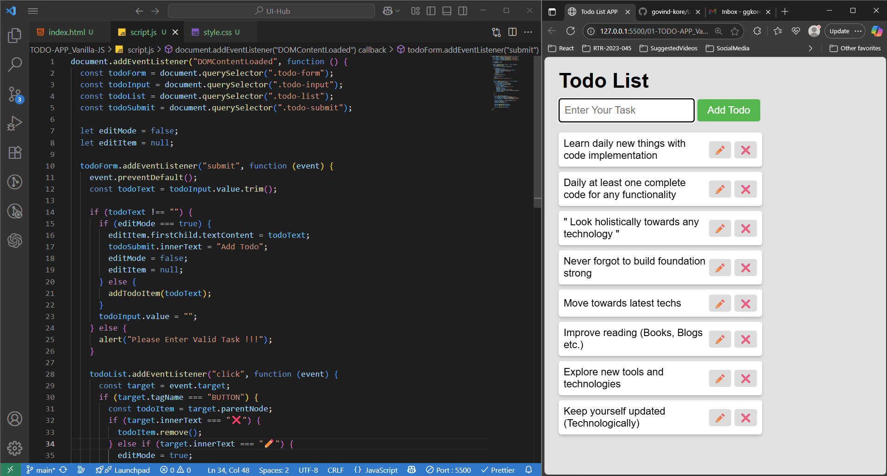

## Todo Application
> This application is built entirely using HTML, CSS, and Vanilla JavaScript. The goal was to revisit and strengthen core JavaScript and CSS concepts by manually implementing UI components and interactions that are typically handled with ease by modern frameworks and tools.

#### Functionalities Covered : 
- Add Todo Task
- Edit Todo Task
- Remove Todo Task

#### Output : 

