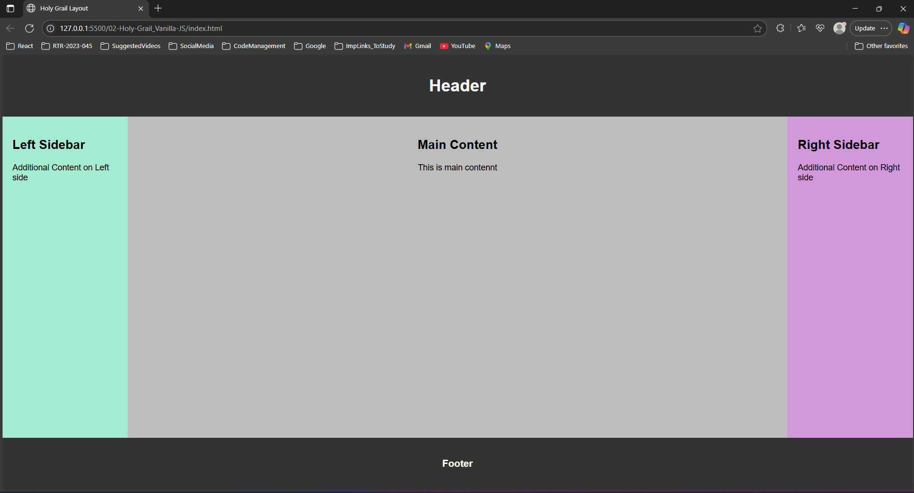

## Holy Grail Application
> This project is a classic Holy Grail layout built entirely using HTML5 and CSS, without any JavaScript or frameworks. It serves as a practical exercise to revisit and reinforce core concepts of semantic HTML structure, CSS layout techniques (like Flexbox), and responsive design principles. The layout includes a header, footer, main content area, and a sidebar—organized in a clean, accessible, and maintainable way. This project emphasizes writing efficient, well-structured code and understanding how modern CSS handles traditional layout challenges.

#### 🪶 Functionalities Covered : 
- No JavaScript or frameworks – Built purely with HTML and CSS
- Responsive layout – Adapts to different screen sizes
- Sticky header and footer – Always visible regardless of scroll
- Flexible middle content – Automatically expands to fill space
- Fixed-width sidebars – Consistent layout control
- Semantic HTML structure – Enhances accessibility and SEO
- Custom styling with CSS variables – Easy to tweak design

#### 🪟 Output : 

#### 🛠️ Use Case :
- Learning Purpose – Perfect for mastering Flexbox/Grid and responsive design
- Layout Template – Acts as a starter layout for blogs, admin panels, or documentation sites
- No-JS Environments – Useful where JS is not preferred or needed (e.g., email templates or lightweight static sites)
- Browser Compatibility Testing – Ensures design consistency across different browsers
- Portfolio Demonstration – Showcases your grasp of core web layout principles

#### 🪛 How to use this Application ?
- Download the repository
- Required modules => **index.html, style.css**
- Open index.html on any browser or run with live server
