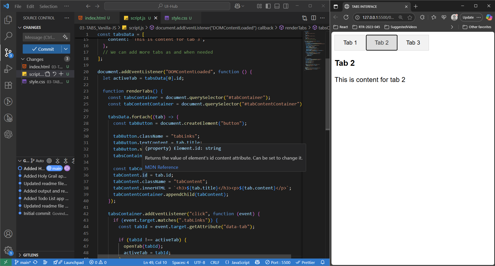

## Tabs Application
> This project demonstrates a fully functional tabbed interface created using only HTML5, CSS3, and Vanilla JavaScript—with no external libraries or frameworks involved. The goal was to revisit and strengthen my understanding of core web development principles by building a UI component from scratch that is commonly used in real-world applications.

> This tab component allows users to switch between different content panels by clicking on tab headers, with smooth transitions and a responsive layout.

#### 🪶 Functionalities Covered : 
- Pure HTML, CSS & Vanilla JavaScript – No dependencies or frameworks
- Clean and semantic HTML structure
- Responsive design – Adjusts to different screen sizes
- Keyboard accessibility – Navigate tabs using arrow keys (if implemented)
- Smooth content transitions – CSS-based transitions when switching tabs
- Active tab highlighting – Visual indication for the selected tab
- Scalable structure – Easy to add/remove tabs
- Custom styling – Fully customizable with CSS

#### 🪟 Output : 

#### 🛠️ Use Case :
- Can be used in dashboards, settings pages, or multi-section forms
- Great example for beginners learning DOM manipulation and event handling
- Helpful reference for vanilla JS exercises

#### 🪛 How to use this Application ?
- Download the repository
- Required modules => **index.html, style.css, script.js**
- Open index.html on any browser or run with live server
