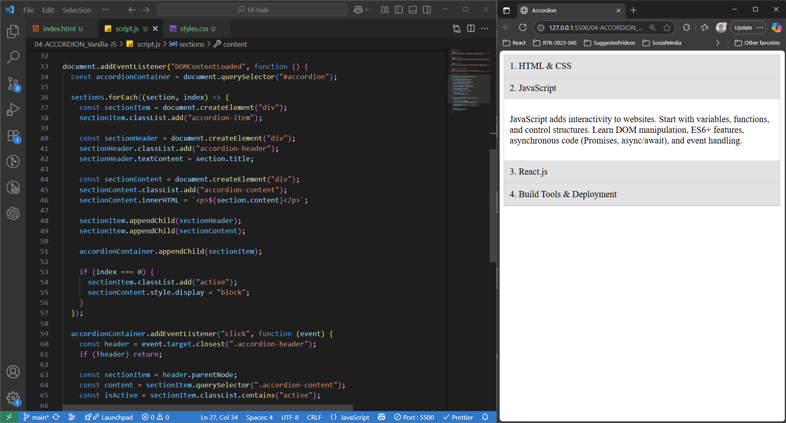

## ACCORDION Application
> This project demonstrates a fully functional accordion UI component built using only **HTML5, CSS3, and Vanilla JavaScript**, with no external libraries or frameworks. The goal was to deepen my understanding of fundamental web development techniques by crafting a common UI interaction from scratch.

> The accordion allows users to expand or collapse individual sections to reveal or hide associated content, helping organize information in a compact and user-friendly way.

#### 🪶 Functionalities Covered : 
- Built with pure HTML, CSS & Vanilla JavaScript — no dependencies
- Clean, semantic HTML structure for better accessibility
- Responsive layout — works well across screen sizes
- Expand/collapse multiple panels with smooth CSS transitions
- Active panel highlighting for better UX
- Supports one or multiple open panels at a time
- Easy to scale — just add more sections in HTML
- Fully customizable styling via CSS

#### 🪟 Output : 

#### 🛠️ Use Case :
- Suitable for FAQs, course outlines, documentation sections, or dashboard modules
- Ideal for learning DOM traversal, manipulation, and event delegation in Vanilla JS
- A practical beginner project that demonstrates interaction logic without React or jQuery

#### 🪛 How to use this Application ?
1. **Clone or download the repository**
2. Ensure you have the following files:
   - `index.html` – main HTML structure
   - `style.css` – styling for layout and transitions
   - `script.js` – JavaScript logic for toggle interaction
3. Open `index.html` in any browser _OR_  Use a Live Server extension (like in VS Code) to preview the app

---
🧠 _This project reflects a strong grasp of core frontend fundamentals by replicating a commonly used UI pattern without relying on frameworks._