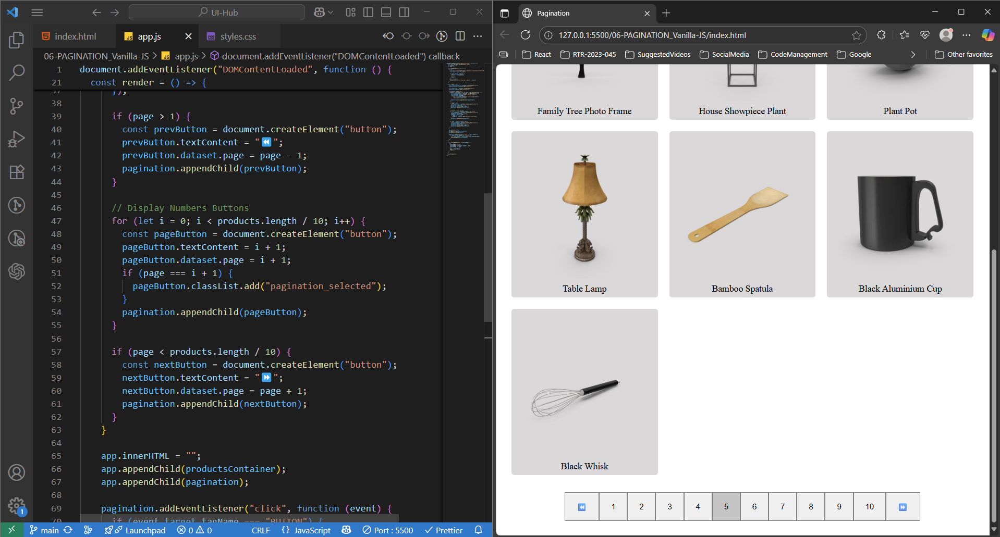

## PAGINATION Application
> This project showcases a fully functional pagination system built using only **HTML5, CSS3, and Vanilla JavaScript**, without any external libraries or frameworks. The aim was to strengthen my understanding of DOM manipulation, event delegation, and dynamic rendering while implementing a commonly used UI pattern from scratch.

> The application fetches product data and displays it in pages of 10 items each. Users can easily navigate between pages using Previous, Next, or direct page number buttons, ensuring smooth and efficient data browsing.

#### 🪶 Functionalities Covered : 
- Built with pure HTML, CSS & Vanilla JavaScript — no dependencies
- Fetches product data dynamically from an API ([https://dummyjson.com/products](https://dummyjson.com/products?limit=100))
- Pagination implemented using event delegation (single event listener on parent element)
- Supports navigation via Previous / Next buttons and direct page numbers
- Highlights the currently active page for better user experience
- Handles edge cases (disables navigation beyond first/last page)
- Clean, modular code with reusable rendering logic
- Responsive layout — adapts to various screen sizes

#### 🪟 Output : 

#### 🛠️ Use Case :
- Suitable for displaying products, blogs, search results, or large datasets
- Ideal for learning event delegation, DOM updates, and working with APIs in Vanilla JS
- A practical beginner-to-intermediate project showcasing real-world UI interaction logic without frameworks
- Demonstrates how to handle client-side pagination with dynamic data

#### 🪛 How to use this Application ?
1. **Clone or download the repository**
2. Ensure you have the following files:
   - `index.html` – main HTML structure
   - `style.css` – styling for layout and transitions
   - `script.js` – JavaScript logic for toggle interaction
3. Open `index.html` in any browser _OR_  Use a Live Server extension (like in VS Code) to preview the app

---
🧠 _This project reflects strong frontend fundamentals, focusing on DOM manipulation, event delegation, and dynamic rendering — all implemented without any frameworks._