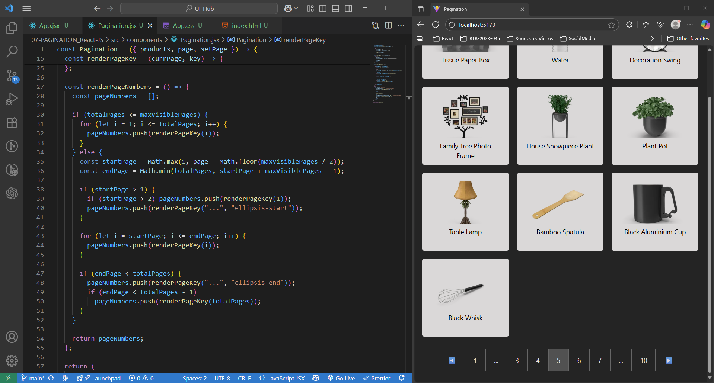

## PAGINATION Application (React JS)
> This project demonstrates a fully functional pagination system built with **React.JS** using useState and useEffect hooks. The objective was to practice React fundamentals like state management, side-effects, conditional rendering, and modular component design while implementing a real-world UI feature.

> The application fetches product data from a dummy API and displays it in pages of 10 items each. Users can navigate seamlessly using Previous, Next, or direct page number buttons along with page truncation logic where 5 pages can see, ensuring an intuitive and responsive browsing experience.

#### 🪶 Functionalities Covered : 
- Built with ReactJS (Functional Components + Hooks)
- Data fetching handled with useEffect and stored in component state (useState)
- Pagination logic implemented in React (slice of dataset per active page)
- Navigation via Previous / Next buttons and direct page numbers along with page Truncation
- Active page indicator highlighted for better UX
- Edge case handling (first/last page navigation disabled appropriately)
- Clean, modular code with reusable Pagination and ProductList components
- Responsive layout for smooth experience across devices

#### 🪟 Output : 

#### 🛠️ Use Case :
- Suitable for product catalogs, blog lists, search results, or large datasets
- Ideal for practicing React Hooks, state management, and API integration
- Demonstrates real-world UI interaction logic like client-side pagination
- Beginner-to-intermediate friendly project that highlights React fundamentals

#### 🪛 How to use this Application ?
1. **Clone or download the repository**
2. Follow below steps one after another:
   - `npm install` – installs all the dependancies
   - `npm run dev` - runs the application
   - `http://localhost:5173/` - open this link on any browser

---
🧠 _This project reflects solid React fundamentals — focusing on hooks (useState, useEffect), API integration, and reusable component design — all applied to build a practical pagination feature._