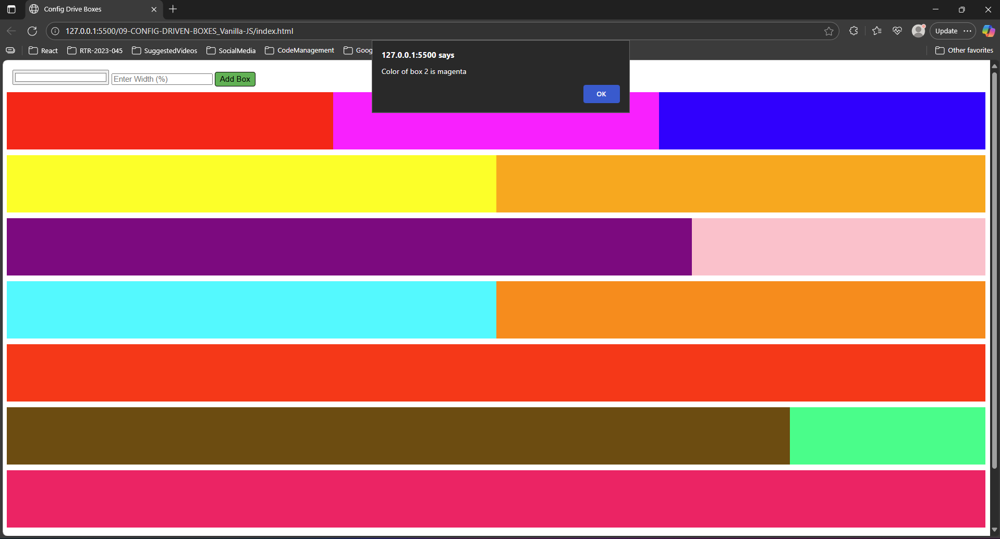

## 🎨 CONFIG-DRIVEN COLOR BOXES Application

> This project demonstrates a **config-driven UI rendering system** built entirely with **HTML5, CSS3, and Vanilla JavaScript**.  
> Instead of hardcoding elements, the application dynamically generates colored boxes based on a configuration object (`boxConfig`).  
> This approach highlights **DOM manipulation, event delegation, and dynamic rendering** without relying on frameworks or external libraries.

---

#### 🪶 Functionalities Covered :
- Dynamically generates colored boxes using a **configuration array (`boxConfig`)**  
- Supports adding new boxes via a form (color + width input)  
- Width is responsive and percentage-based (e.g., `33.33%`, `50%`)  
- Default width set to **100%** if no input is provided  
- Click on any box to see its **color in an alert (event delegation)**  
- Clean, modular design with reusable rendering logic  
- Reset functionality for input fields after form submission  

---

#### 🪟 Output :

---

#### 🛠️ Use Case :
- Useful for **config-driven UI rendering** (dashboards, customizable layouts, design systems)  
- Helps beginners understand **DOM creation, event handling, and array-driven rendering**  
- Demonstrates **event delegation** (one listener handling multiple box clicks)  
- A great beginner-to-intermediate project to practice **dynamic UI updates**  

---

#### 🪛 How to use this Application ?
1. **Clone or download the repository**
2. Ensure you have the following files:
   - `index.html` – main HTML structure with the form  
   - `style.css` – styling for the boxes and layout  
   - `script.js` – JavaScript logic for config-driven rendering  
3. Open `index.html` in any browser _OR_ use Live Server in VS Code  

---

🧠 _This project emphasizes **config-driven design** and showcases how UI can be dynamically created and updated through JavaScript — no frameworks required._
